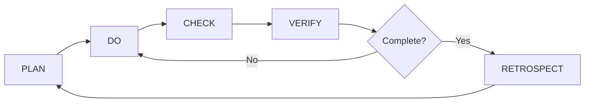

# PLAN-DO-CHECK-VERIFY-RETROSPECT (PDCVR)

A comprehensive framework and toolkit for AI-assisted software development using continuous improvement cycles.

## Overview

This framework provides a structured methodology for development work with AI assistants like Claude Code. It extends the **Plan-Do-Check-Act (PDCA)** cycle with explicit **VERIFY** and **RETROSPECT** phases to ensure quality, continuous improvement, and enterprise-grade results.

## Framework Components

### 1. Prompts & Templates (`prompts-templates/`)

| Phase | File | Purpose |
|-------|------|---------|
| **PLAN** | `plan.md` | High-level analysis and detailed planning with TDD discipline |
| **PLAN + DO** | `prompt-template-for-coding.md` | Unified template including CONTEXT, REQUEST, and complete PLAN phase (Part 1 & 2) with TDD guidelines |
| **CHECK** | `check.md` | Completeness check and closure verification (8 phases) |
| **VERIFY** | (integrated in check.md) | Build verification, testing validation, deployment readiness - uses `build-verification-agent` |
| **RETROSPECT (ACT)** | `retrospect.md` | Post-session analysis and improvement identification |

### 2. Specialized Subagents (`claude-code-subagents-for-coding/`)

25+ specialized AI agents for different development tasks:

- **Orchestration**: `orchestrator-ai-router`, `memory-ai-context-manager`
- **Architecture**: `software-architect-hld`, `system-analyzer`
- **Planning**: `product-manager-prd`, `user-story-creator`, `ui-ux-designer`
- **Execution**: `enterprise-coder-ai`, `executor-ai-agent`
- **Quality**: `qa-automation-engineer`, `quality-analyzer-scorer`, `build-verification-agent`
- **Infrastructure**: `devops-infra-deployer`, `git-repository-manager`
- **Documentation**: `documentation-generator`, `web-research-analyst`

## Development Workflow

### PLAN Phase
- Business problem definition
- Mandatory codebase investigation
- Technical approach evaluation (2-3 options)
- Detailed implementation steps with TDD discipline

### DO Phase
- Execute following the plan with appropriate subagents
- Strict TDD: Red-Green-Refactor cycle
- Incremental changes with verification
- Maximum 3 attempts per step before human intervention

### CHECK Phase
- Goal alignment verification
- Technical quality checks (code quality, testing coverage)
- Regression and integration validation
- Documentation and knowledge transfer review

### VERIFY Phase
- Build & deployment verification
- Quality gates and standards compliance
- Risk assessment and rollback readiness
- Completeness score (minimum 40/50 = 80%)

### RETROSPECT (ACT) Phase
- **Note**: ACT and RETROSPECT are the same phase
- Critical moments analysis
- Waste and wrong path identification
- Success metrics calculation
- "The One Most Valuable Change" for next session

## Core Principles

- **TDD Discipline**: Tests first, then implementation
- **Enterprise-Grade**: No hardcoded values, multi-tenant aware
- **Process Safeguards**: Atomic steps, clear acceptance criteria
- **Quality Control**: Iterative review until consensus

## Usage with Claude Code

### Quick Start

1. **PLAN Phase**: Use `prompts-templates/prompt-template-for-coding.md` as your main prompt
   - Fill in the CONTEXT section (date, timezone, workspace)
   - Add your requirement in the REQUEST REQUIREMENT INSTRUCTION section
   - The template includes Part 1 (High-Level Analysis) and Part 2 (Detailed Planning)

2. **DO Phase**: Execute following the plan
   - Say "Begin with Step 1" or "Proceed with Step 1"
   - Follow strict TDD: Red-Green-Refactor cycle
   - Use specialized subagents via the Task tool for complex tasks

3. **CHECK Phase**: Use `prompts-templates/check.md`
   - Run through the 8-phase completeness verification
   - Ensure all acceptance criteria are met

4. **VERIFY Phase**: Invoke `build-verification-agent`
   - Verify everything compiles successfully
   - Ensure all requirements are implemented

5. **RETROSPECT Phase**: Use `prompts-templates/retrospect.md`
   - Analyze what went well and what didn't
   - Identify "The One Most Valuable Change" for next session

### Prompt Template Structure

The `prompt-template-for-coding.md` includes:
- **CONTEXT**: Date, timezone, workspace directory, reads (CLAUDE.md, PRDs, etc.)
- **REQUEST REQUIREMENT INSTRUCTION**: Environment details and your specific requirement
- **PART 1: HIGH-LEVEL ANALYSIS**: Business problem, codebase investigation, technical approach
- **PART 2: DETAILED PLANNING**: Implementation steps with TDD discipline, acceptance criteria
- **TDD Guidelines**: Red-Green-Refactor cycle and principles
- **CRITICAL REMINDERS**: Ultrathink, use agents, iterate and review

See [CLAUDE.md](CLAUDE.md) for detailed guidance on using this framework with Claude Code.

## License

See [LICENSE](LICENSE) file.
